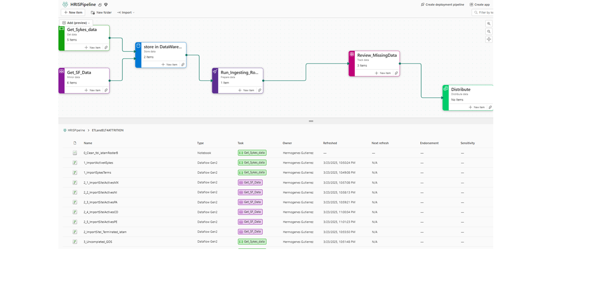
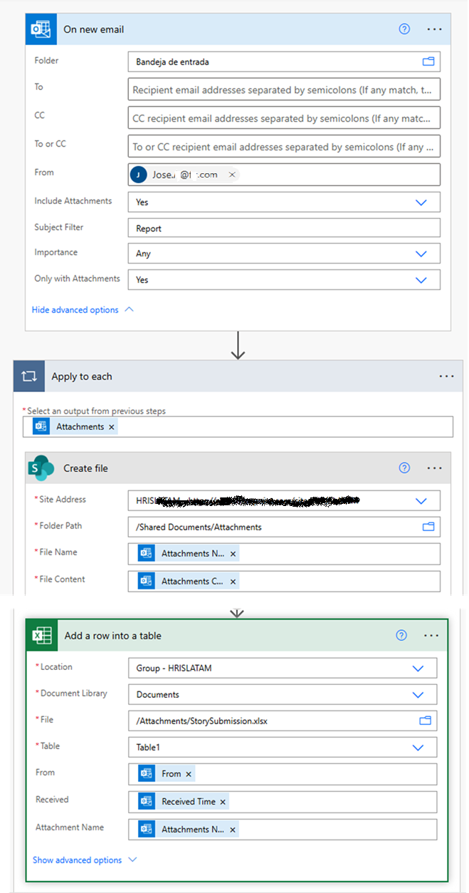

# Data-Crunching
This project builds a Microsoft Fabric data pipeline to automate ingestion and transformation of HR data from reports received trough Outlook and a local HR system, cutting manual processing time and improving data quality for downstream reporting.
## Overview
Purpose: Build an automated, maintainable data pipeline in Microsoft Fabric to ingest two primary sources—email reports (Outlook) and local HR system extracts—and perform standardized transformations so downstream analytics and reports are delivered faster and with consistent quality. Primary benefit: reduce manual effort and end-to-end processing time while improving traceability and repeatability.

## Architecture

## Technologies Used
- Power Automate flow (Cloud, Automated)
- Outlook
- Excel Online and Desktop
- Microsoft Fabric
- On Premises Sql Server and SSMS
- Integration Services
- Power BI Desktop
- Power BI Services

## Pipeline Steps

### 1. Extract
1.1 Data is ingested from two primary sources, both delivered in Excel format and landed in a SharePoint document library for downstream processing.


First source — Outlook attachments Two Excel workbooks, Active headcount and Attrition report, are received as attachments in Outlook email messages. A Power Automate flow automatically downloads these attachments and uploads them to a designated SharePoint document library, eliminating manual intervention.
### Power Automate Sample


Second source — Local HR system exports Two reports exported from the local HR system — All associate data and Termination report — are produced manually and then uploaded to the same SharePoint document library for consistency with the Outlook-sourced files.

Notes

All incoming files are centralized in SharePoint to provide a single staging location for validation and transformation.

The automated Outlook ingestion reduces manual steps; HR system extracts remain a manual step but follow the same landing pattern for downstream processing.

### 2. Transform


Describe cleaning, logic, and transformation steps.  
Example:  
- Removes duplicates  
- Fills missing values  
- Aggregates monthly sales  

### 3. Load
Explain where the transformed data goes.  
Example:  
Loads cleaned data into `sales_data` table in PostgreSQL.

## How to Run

1. Clone the repo:
    ```
    git clone https://github.com/yourusername/etl-sales-pipeline.git
    cd etl-sales-pipeline
    ```

2. Install dependencies:
    ```
    pip install -r requirements.txt
    ```

3. Set up database connection settings in `config.yaml` or environment variables.

4. Run the ETL script:
    ```
    python etl_pipeline.py
    ```

## Project Structure
```
etl-sales-pipeline/
├── data/
│   └── sales.csv
├── etl_pipeline.py
├── requirements.txt
├── config.yaml
├── tests/
│   └── test_transform.py
├── docs/
│   └── architecture.png
└── README.md
```

## Testing
Describe how to run tests:
```
pytest tests/
```

## License
[MIT License] or other as appropriate.

## Credits
Mention collaborators, data sources, and referenced projects.

## Contact
Email or LinkedIn for professional inquiries.
