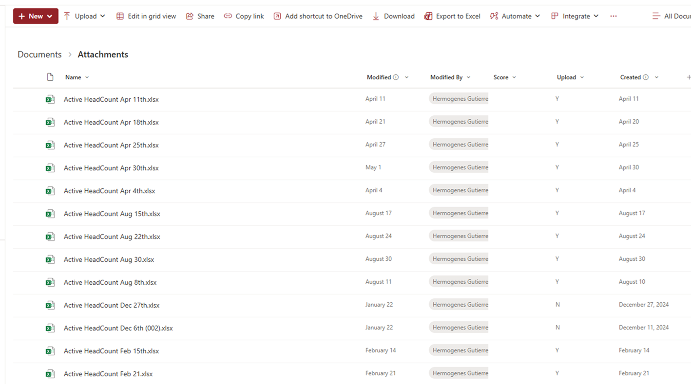
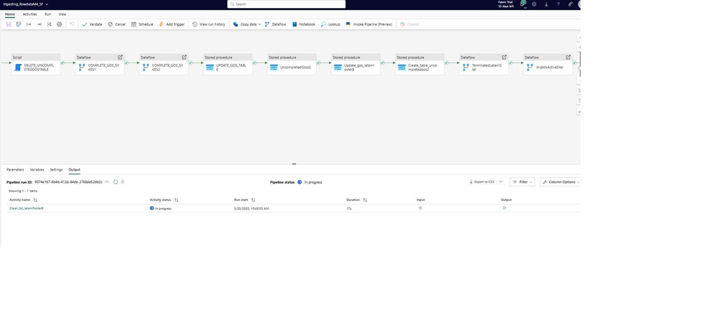

# Data-Crunching
This project builds a Microsoft Fabric data pipeline to automate ingestion and transformation of HR data from reports received trough Outlook and a local HR system, cutting manual processing time and improving data quality for downstream reporting.
## Overview
Purpose: Build an automated, maintainable data pipeline in Microsoft Fabric to ingest two primary sources—email reports (Outlook) and local HR system extracts—and perform standardized transformations so downstream analytics and reports are delivered faster and with consistent quality. Primary benefit: reduce manual effort and end-to-end processing time while improving traceability and repeatability.

## Architecture

## Technologies Used
- Power Automate flow (Cloud, Automated)
- Outlook
- Excel Online and Desktop
- Microsoft Fabric
- On Premises Sql Server and SSMS
- Integration Services
- Power BI Desktop
- Power BI Services

## Pipeline Steps

### 1. Extract
Data is ingested from two primary sources, both delivered in Excel format and landed in a SharePoint document library for downstream processing.


First source — Outlook attachments Two Excel workbooks, Active headcount and Attrition report, are received as attachments in Outlook email messages. A Power Automate flow automatically downloads these attachments and uploads them to a designated SharePoint document library, eliminating manual intervention.
### Power Automate Sample
   

Excel files received by e-mail are automatically stored in a sharepoint library document



Second source — Local HR system exports Two reports exported from the local HR system — All associate data and Termination report — are produced manually and then uploaded to the same SharePoint document library for consistency with the Outlook-sourced files.

Notes

All incoming files are centralized in SharePoint to provide a single staging location for validation and transformation.

The automated Outlook ingestion reduces manual steps; HR system extracts remain a manual step but follow the same landing pattern for downstream processing.

### 2. Transform

The transformation stage is implemented in Microsoft Fabric and centers on a Fabric data warehouse that contains multiple staging and curated tables. **Dataflows**, **SQL scripts**, and **stored procedures** are used to import, parse, normalize, deduplicate, and enrich incoming rows. Automated validation detects missing or inconsistent values and routes those records to a review queue for manual inspection and correction. Once records pass validation, the cleaned data is loaded into the target **SQL Server** tables for downstream reporting.

**Key components**  
- **Data warehouse:** staging and curated schemas for traceability.  
- **Dataflows:** orchestrated imports and row-level transformations.  
- **Scripts & stored procedures:** complex business rules, joins, and bulk operations.  
- **Validation & review:** automated checks plus manual review for exceptions.  
- **Load to SQL Server:** final push of validated, cleaned data for consumers.


### 3. Load
Once records have been validated and approved, the cleaned data is moved from Microsoft Fabric into the target SQL Server table tbl_LatamrostersB using an SSIS package developed in Visual Studio.


## How to Run

1. Review if powerautomate flow run correctly:-
     
2. Extrac Successfactor Reports and uploaded in sharepoint library :
    
3. go to workspace in microsoft fabric and open the datapipeline named IngestingrawdataM4_SF and hit on run action.

5. Run the SSIS package:
 


## Project Structure
```
![overview](

## Testing
Describe how to run tests:
```
pytest tests/
```

## License
[MIT License] or other as appropriate.

## Credits
Mention collaborators, data sources, and referenced projects.

## Contact
Email or LinkedIn for professional inquiries.
